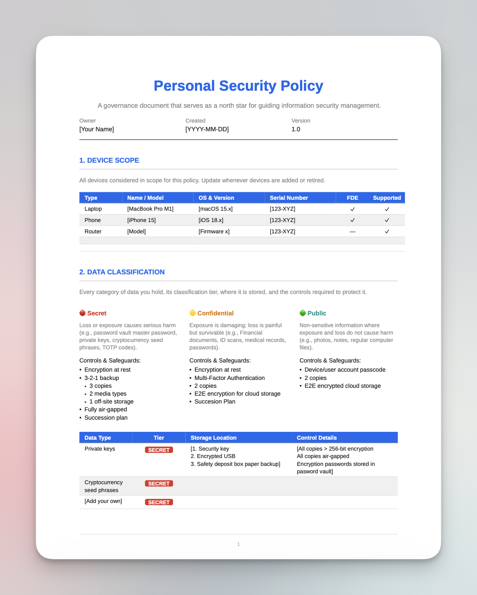

# Personal Security Policy Template


A clean, printable **Typst** template for maintaining a personal information security policy.

Inspired by the structure of a corporate InfoSec policy, scaled down for individual use.

## Preview

See a compiled PDF of the template [here](personal-security-policy-template.pdf).



## What's Inside

The template compiles to a multi-page PDF with the following sections:

| Section | Purpose |
| --- | --- |
| **1. Device Scope** | Inventory of devices covered by the policy — type, OS, serial, encryption status |
| **2. Data Classification** | Critical / Sensitive / Replaceable tiers with backup requirements for each |
| **3. Personal Threat Model** | Realistic threats with likelihood, impact, and primary mitigation |
| **4. Accepted Risks** | Documented, justified security tradeoffs — with a review date |
| **5. Security Tooling Register** | Password manager, MFA, hardware keys, backups, VPN, DNS filtering, etc. |
| **6. Review & Audit Log** | Record of every policy review |
| **7. Backup Restore Test Log** | Proof your backups actually restore, not just that they exist |
| **8. Incident Log** | What happened, how it was handled, what changed afterward |
| **9. Emergency Reference** | Print-and-file page with recovery contacts and fraud lines (no credentials) |

## Requirements

- [Typst](https://typst.app/) `0.11+`
- The `Liberation Sans` font (or swap for any font available on your system)

## Usage

1. Install Typst:

   ```bash
   # macOS
   brew install typst
   ```

2. Clone this repo and compile:

   ```bash
   git clone https://github.com/adammfurman/personal-security-policy-template.git
   cd personal-security-policy-tempalte
   typst compile personal-security-policy-template.typ
   ```

3. Or watch for changes while you edit:

   ```bash
   typst watch personal-security-policy-template.typ
   ```

## Customization

All document-level settings live at the top of the file under `DOCUMENT VARIABLES`:

```typst
#let owner = "[Your Name]"
#let created = "[YYYY-MM-DD]"
#let updated = "[YYYY-MM-DD]"
#let version = "1.0"
```

Change `#let accent = blue` to any of the predefined palette colors (`c-navy`, `c-blue`, `c-teal`, `c-amber`, `c-red`, `c-purple`) or your own `rgb(...)` value to re-theme the whole document.

Every `[BRACKETED]` placeholder throughout the file is meant to be replaced with your own information — device details, threats, tooling, emergency contacts, etc. Rows and risks can be duplicated or removed as needed.

## Recommended Workflow

- Fill out Sections 1–4 in full on first use.
- Re-review and rewrite Sections 1–4 annually (there's a reminder at the bottom of the document).
- Log every backup restore test in Section 7 — quarterly at minimum.
- Log every security-relevant event, however minor, in Section 8.
- Keep the digital source encrypted in your password manager or other secure location.
- Print Section 9 (Emergency Reference) and store it with your physical legal documents or in a fireproof safe.

## Security Note

This document is intended to hold **references to** sensitive material (e.g., "backup codes at: [location]"), not the sensitive material itself. Do not put actual passwords, private keys, or recovery codes directly in this file.

## License

GPLv3 — see [LICENSE](LICENSE) for details.

Original template by [Adam M. Furman](https://adamfurman.me).
